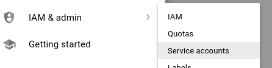
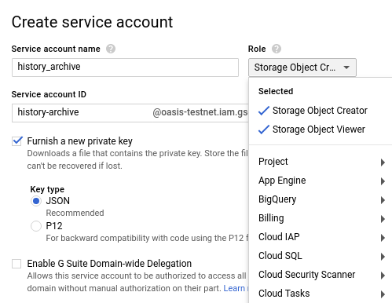
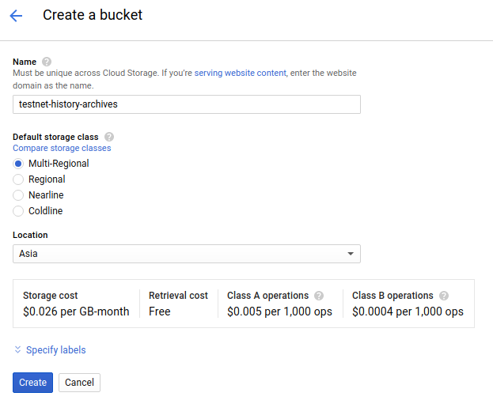
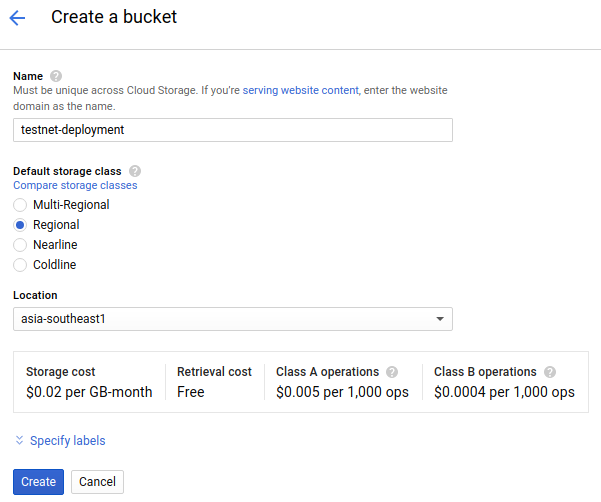
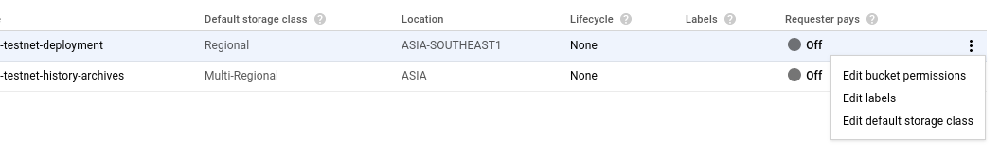
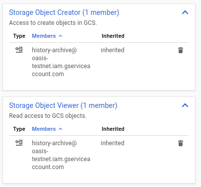
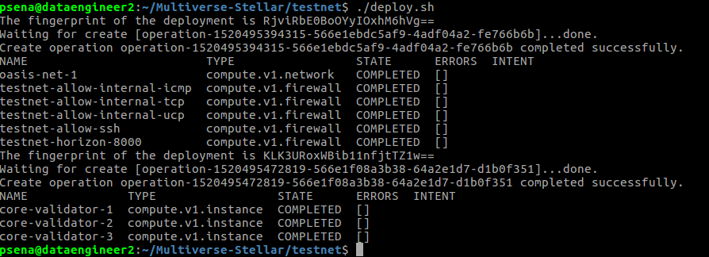
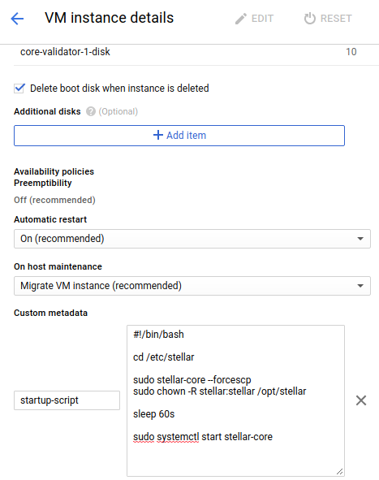

# Install Private Stellar Network on Google Cloud

This is CLOUD DEPLOYMENT MANAGER template for create and running Stellar Core Validator with 3 nodes. The configruation including installation local PostgreSQL database instance on each nodes.

Stellar-core and PostgreSQL are all running in the same GCE on difference zone.

**Ref:**<br>
[Stellar Docs](https://www.stellar.org/developers/stellar-core/software/admin.html)<br>
[stellar-installation-packate](https://github.com/stellar/packages#sdf---packages)<br>
[stellar-archivist](https://github.com/stellar/go/tree/master/tools/stellar-archivist)<br>

### Cost
The template creates a number of resources but the majority of them do not attract charges. You will be billed for the following resources:
* A GCE instance for every nodes.
* Cloud Storage capacity

Disclaimer: While we attempt to provide useful and up to date information, you are responsible for your own GCP account and the resources that you are charged for. Always be vigilant about doubling checking to ensure that the resources used are what your expect. 

### Template
The template files is .yaml and .jinja in the template folders, you will be edit parameter before running.

---
### Installation
Aside from having an Google Cloud account, You must create empty project first.

#### 1. Create Service accounts with permission to access to Google Cloud Storage






Service account ID will be use as parameter for deploy instances in next step.

#### 2. Create Cloud Storage bucket for history archive
Create bucket with storage class as "Multi-Regional"


#### 3. Create Cloud Storage bucket for Deployment scripts
Create bucket with storage class as "Regional"


#### 4. Add permission access to Cloud Storage bucket


<br>
Check Cloud Storage bucket already have allow Service accounts to access.

#### 5. Edit Stellar Network parameter

\#Google Cloud Project name<br>
GCP_PROJECT_NAME="myprivate-testnet"     << your GCP project name

\#Google Cloud service account that allow to access GCS buckets<br>
GCE_SERVICE_ACCOUNT=""        << use from step 1.

\#Google Cloud Network name will be create during setup<br>
GCP_NETWORK_NAME="testnet-net-1"      << your desire GCP network name 

\#GCS Bucket name of history archive to keep history data of stellar network<br>
HISTORY_ARCHIVE="testnet-history-archives"    << use from step 2.

\#GCS Bucket name of deployments script<br>
DEPLOYMENT_SCRIPTS="testnet-deployment" << use from step 3.

\#VM name to display for each instance<br>
CORE_VAL_NAME_PREFIX="core-validator"

\#Your Stellar NETWORK PASSPHRASE<br>
STELLAR_NETWORK_PASSPHRASE="Oasis-Testnet.March-2018"

\#Specific machine size and capacity<br>
MACHINE_TYPE="n1-standard-1"

\#PSQL database information on every nodes<br>
(I use same info for all instance.)<br>
PSQL_DBNAME="core"<br>
PSQL_USERNAME="xxxx"<br>
PSQL_PASSWORD="xxxx"

CORE_VALIDATOR_KEY_1="SD5QQI2M3UBXBADMAJELA26L6OTGF3K2RWSEYZIDUAZHKV23DVRBALD6"<br>
CORE_VALIDATOR_PUBKEY_1="GDJEPYTVQ2YZO7C3RKIY255TSGCRMEAML3FOSOUS5AO6BRPVJSQKPREK"<br>
CORE_ZONE_1="asia-southeast1-a"

CORE_VALIDATOR_KEY_2="SAVPGGRFIVG5LZXDHRHXVNNWFUIDOUZQAHOG3T6OELR2AETSNEPIJRA4"<br>
CORE_VALIDATOR_PUBKEY_2="GA4JVDDC6WJOKBDQFO4BOLGL6TEIO6M4VEZKULTKUCEZOXYYCEG733J6"<br>
CORE_ZONE_2="asia-southeast1-b"

CORE_VALIDATOR_KEY_3="SDGTXMWIJAIBTTLDYVE5VGO3QTQ3JWDOMJRLCNTIEIOMQ2HY32QGS7BM"<br>
CORE_VALIDATOR_PUBKEY_3="GA2TY264IVMGOSGWEC7VBKN5XLVD2JZE6V4A2TCO5IG7MBD7QCFEOEV7"<br>
CORE_ZONE_3="asia-east1-c"


**CORE_VALIDATOR_KEY** is public/private for your nodes. Nodes shouldn’t share keys. You should carefully **secure your private key**. If it is compromised, someone can send false messages to the network and those messages will look like they came from you.

Generate a key pair like this:<br>
**$ stellar-core --genseed**<br>
the output will look like
```
Secret seed: SBAAOHEU4WSWX6GBZ3VOXEGQGWRBJ72ZN3B3MFAJZWXRYGDIWHQO37SY
Public: GDMTUTQRCP6L3JQKX3OOKYIGZC6LG2O6K2BSUCI6WNGLL4XXCIB3OK2P
```
Please update to your nodes private key if possible.

#### 6. run setup scripts
```sh
$ chmod u+x setup.sh
$ ./setup.sh
```
Results is to generate deployment scripts as show in folder /template

#### 7. run Google Cloud Deployment Manager to create Stellar Network
```sh
$ chmod u+x deploy.sh
$ ./deploy.sh
```



Deploy log should be show detail of Network. Firewall and GCE instance of Stellar-Core validator.


---
### Post installation
#### 1. Check Stellar Core services running in normal states.
```sh
$ tail /var/log/syslog
Mar  8 09:51:06 core-validator-3 stellar-core[2016]: 2018-03-08T09:51:06.797 GA2TY [Ledger INFO] Got consensus: [seq=508, prev=2d1ceb, tx_count=0, sv: [  txH: 8e9332, ct: 1520502666, upgrades: [ ] ]]
Mar  8 09:51:06 core-validator-3 stellar-core[2016]: 2018-03-08T09:51:06.801 GA2TY [Ledger INFO] Closed ledger: [seq=508, hash=9f7d3c]
```
Log must show sequence number of ledger.

```sh
$ cd /etc/stellar
$ stellar-core-cmd info
```


state must be **Synced!**

```sh
$ sudo systemctl status stellar-core
```


#### 2. Edit startup scripts of all GCE instance 
Default startup scripts are install Stellar Network software and related.<br>
`You need to edit Custom metadata of GCE instance to prevent RESET database history and archive history.<br>
Most Stellar-core failed is services start before PostgreSQL database ready.`<br>
You can see detail in /var/log/syslog for information of start service failed.<br>
Manual workaround by restart stellar-core services when database ready.<br>
The options to increase wait time longer than 60s for database ready can be update in startup scripts.

```sh
#!/bin/bash

cd /etc/stellar

sudo stellar-core --forcescp
sudo chown -R stellar:stellar /opt/stellar

sleep 60s

sudo systemctl start stellar-core
```


---
### How to find Root account secret key
when stellar-core start to create new database will be log at path /etc/stellar.<br>
Look at the stellar-core.*.log file for information.<br>
The installation scripts will delete all log files on all stellar-core instance **except core-validater-1** for you to ssh into instance and get information and remove log file to secure Root account secre key.<br>

Example:
```sh
cd /etc/stellar
cat stellar-core.*.log
```


**Remove log contains Root account secret key when done**


---
## Notes<br>
* Documents to install Stellar-Core + Horizon to connect to Private Stellar Network will coming soon<br>
* If you have any question please send email to **pitchayasak.s@gmail.com**

---
