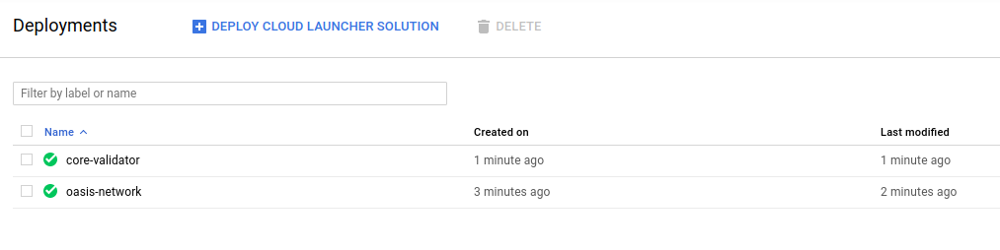
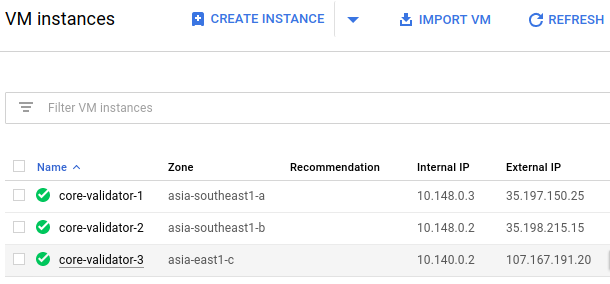
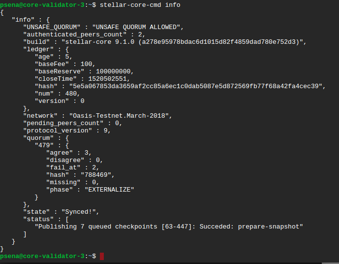
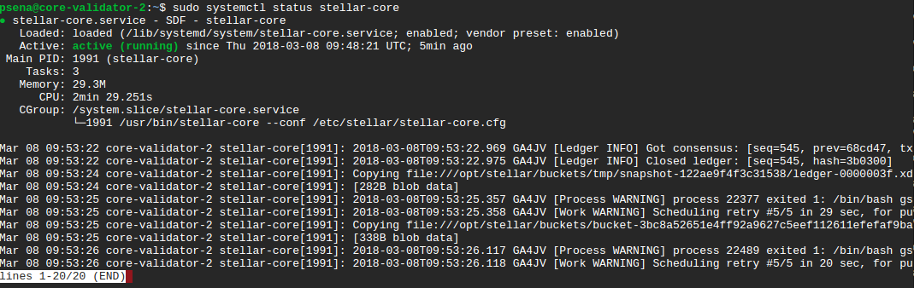
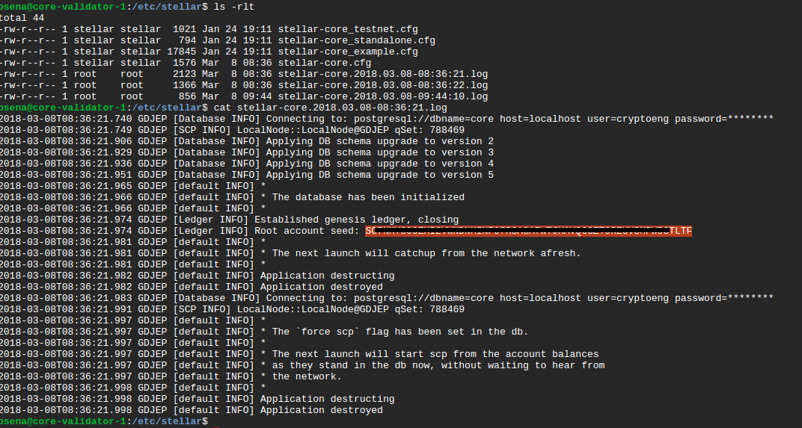

# Install Private Stellar Network on Google Cloud

This is CLOUD DEPLOYMENT MANAGER template for creating and running Stellar Core Validator with 3 nodes of Stellar Core Validator. The configuration includes installing local PostgreSQL database instance on each nodes.

Stellar-core and PostgreSQL are all running in the same GCE on difference zone.

**Installation documents**
[Install Stellar Core Validator](#core-validator)

**Ref:**<br>
[Stellar Docs](https://www.stellar.org/developers/stellar-core/software/admin.html)<br>
[stellar-installation-package](https://github.com/stellar/packages#sdf---packages)<br>
[stellar-archivist](https://github.com/stellar/go/tree/master/tools/stellar-archivist)<br>

### Cost
The template creates a number of resources but the majority of them do not attract charges. You will be billed for the following resources:
* A GCE instance for every node.
* Cloud Storage capacity

Disclaimer: While we attempt to provide useful and up to date information, you are responsible for your own GCP account and the resources that you are charged for. Always be vigilant about doubling checking to ensure that the resources used are what your expect. 

### Template
The template files is .yaml and .jinja in the template folders, you are supposed to edit parameters before running.

---
## <a id="core-validator"></a>Install Stellar Core Validator
Aside from having an Google Cloud account, You must create empty project first.

* `cp config.ini.template config.ini` *(Edit config file with your parameters. **GCP_PROJEC_NAME** must be change to your current GCP project name)*
* `./build.sh` 
* `./deploy.sh`

Deploy log should be show detail of Network. Firewall and GCE instance of Stellar-Core validator.  
  
  

## Post installation
#### Check Stellar Core services running in normal states.
```sh
$ tail /var/log/syslog
Mar  8 09:51:06 core-validator-3 stellar-core[2016]: 2018-03-08T09:51:06.797 GA2TY [Ledger INFO] Got consensus: [seq=508, prev=2d1ceb, tx_count=0, sv: [  txH: 8e9332, ct: 1520502666, upgrades: [ ] ]]
Mar  8 09:51:06 core-validator-3 stellar-core[2016]: 2018-03-08T09:51:06.801 GA2TY [Ledger INFO] Closed ledger: [seq=508, hash=9f7d3c]
```
Log must show sequence number of ledger.

```sh
$ cd /etc/stellar
$ stellar-core-cmd info
```


state must be **Synced!**

```sh
$ sudo systemctl status stellar-core
```


#### Patch GCE instances startup scripts
This script is to remove installation code and replace with restart instance script.
Please make sure all Stellar Core instance are run to creating ledger with state Synced.
* `./patch.sh`  

---
#### Collect the Root account secret key
when stellar-core start to create new database will be log at path /etc/stellar.<br>
Look at the stellar-core.*.log file for information.<br>
The installation scripts will delete all log files on all stellar-core instance **except core-validater-1** for you to ssh into instance and get information and remove log file to secure Root account secre key.<br>

* `cd /etc/stellar`
* `cat stellar-core.*.log`  


** *Remove log contains Root account secret key when done.*

---
#### Uninstall

* `./undeploy.sh`

---
## Notes<br>
* If you have any question please send email to **pitchayasak.s@gmail.com**

