# Install Stellar Core and Horizon on Google Cloud

This is CLOUD DEPLOYMENT MANAGER template for create and running Stellar Core watcher that not required to participates in consensus and Stellar Horizon ingest mode in same node instance. The configuration including create Cloud SQL PostgreSQL database instance for high availability purpose.

Stellar-core and Stellar-horizon are all running in 1 GCE VM instance.

**Ref:**<br>
[Stellar Docs](https://www.stellar.org/developers/stellar-core/software/admin.html)<br>
[stellar-installation-package](https://github.com/stellar/packages#sdf---packages)<br>

### Template
The template files is .yaml and .jinja in the template folders, you will be edit parameter before running.

---
### Prerequisites
* Existing Stellar Network with stellar-core.cfg and information for new stellar-core to connect to.
* A PostgreSQL database instances that have high availability features. You can create new database follow by this documents or skip the Cloud SQL installation if you already have PostgreSQL. 

# Begin Installation
#### 1. Create Google Cloud SQL instance
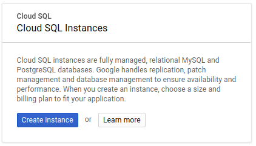

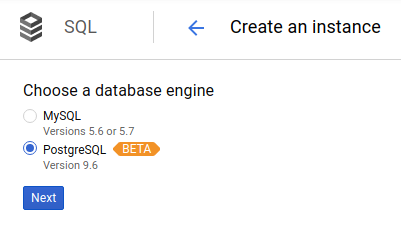

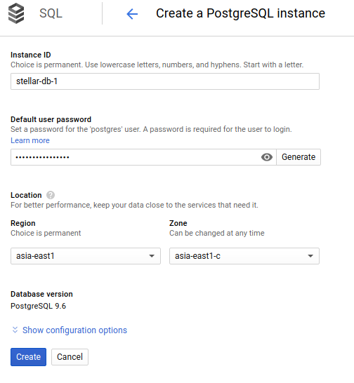

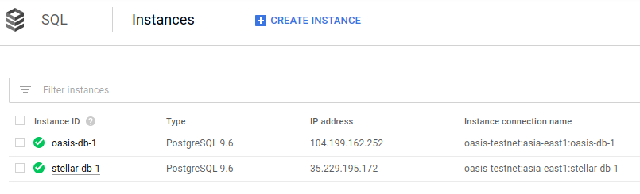<br>
Click on Instance name and go to the detail page.

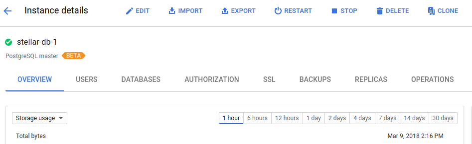

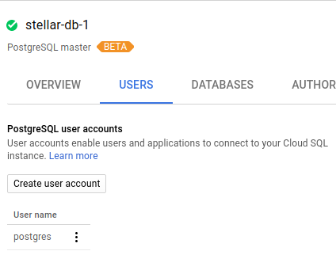<br>
Click at USERS tab and "Create user account" button then insert username and password. Click CREATE to finish.

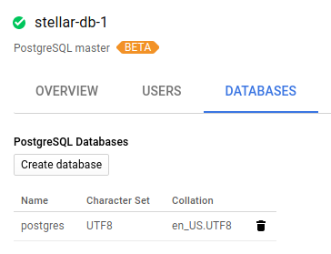<br>
Click at DATABASES tab and "Create database" button then create "core" and "horizon" database.

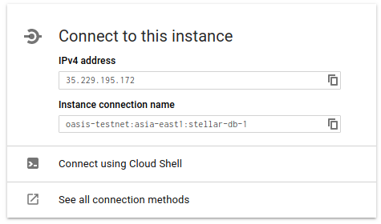<br>
Copy **Instance connection name** and paste into config.ini for **CLOUD_SQL_INSTANCE**

Back to Instance details page and click at "Connect using Cloud Shell".<br>
Cloud shell will display unix prompt and provide command line to connect to database. Press "Enter".<br>
Wait 2-3 seconds. It's ask password for connect to databases. Use password from database creation steps.

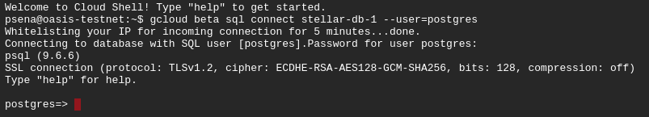<br>
run command to grant your database user to have permission to create/insert/update/delete in core and horizon database.

```sql
postgres=> grant all privileges on database core to testnetadmin;
postgres=> grant all privileges on database horizon to testnetadmin;
```
You can replace database user "testnetadmin" to your desire username.<br>
Database username and password will be update to config.ini files in next steps.

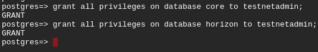

#### 2. Enabled Cloud SQL API to your GCP project
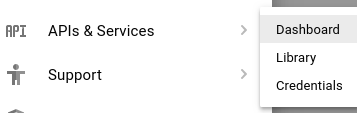

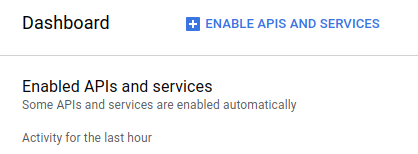<br>
Then click "ENABLE APIS AND SERVICES"<br>

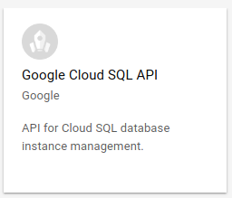<br>
Search for "Google Cloud SQL API"

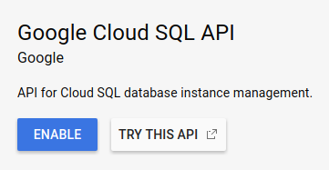<br>
Click "ENABLE"

#### 2. Create service account for GCE to use Cloud SQL API and access to GCS history archive.
<br>
Click "CREATE SERVICE ACCOUNT"

<br>
Service account ID will be use in config.ini as **CH_GCE_SERVICE_ACCOUNT**<br>
Put the **Json private key** generate from this step to **src** folder and rename file to cloudsql.json

<font color="red">Check new service account are member of Storage Object Viewer of <b>GCS bucket</b></font>

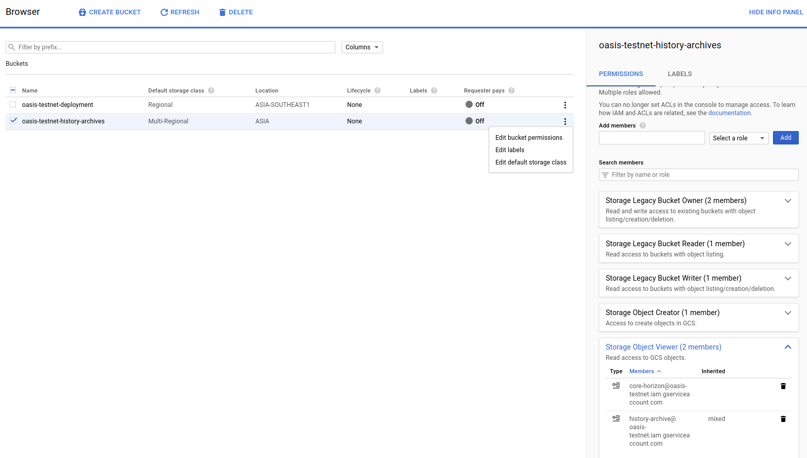

### 3. Edit Stellar Network parameter
```sh
$ cp config.ini.template config.ini
```

Edit config file with your parameters.

\#Google Cloud service account that allow to access GCS buckets<br>
CH_GCE_SERVICE_ACCOUNT=""

\#VM name to display for instance<br>
CH_NAME_PREFIX="core-validator"

\#Specific machine size and capacity<br>
CH_MACHINE_TYPE="n1-standard-1"

\#PSQL database information on every nodes<br>
(I use same info for all instance.)<br>
CH_PSQL_CORE_DBNAME="core"<br>
CH_PSQL_HORIZON_DBNAME="horizon"<br>
CH_PSQL_USERNAME="xxxx"<br>
CH_PSQL_PASSWORD="xxxx"

CORE_HORIZON_ZONE="asia-east1-c"

Explain only for Core watcher and Horizon configuration.<br>
More parameters are lists [here](README.md)

#### 6. run setup scripts
```sh
$ chmod u+x setup.sh
$ ./setup.sh
```
Results is to generate deployment scripts as show in folder /template

#### 7. run Google Cloud Deployment Manager to create Stellar Network
```sh
$ chmod u+x deploy.sh
$ ./deploy.sh
```

```
If you want to install only Core-watcher and Horizon.
Comment all line except core-horizon deployment in file deploy.sh before run scripts.
```

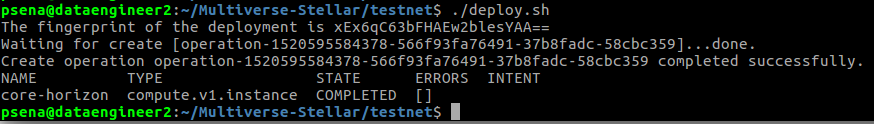

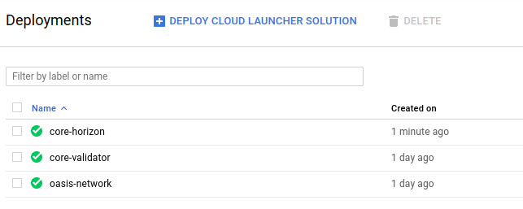

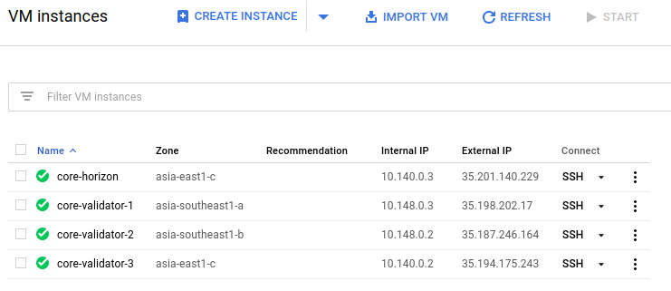

---
### Post installation
#### 1. Check Stellar Core services running in normal states.
```sh
$ tail /var/log/syslog
Mar  8 09:51:06 core-validator-3 stellar-core[2016]: 2018-03-08T09:51:06.797 GA2TY [Ledger INFO] Got consensus: [seq=508, prev=2d1ceb, tx_count=0, sv: [  txH: 8e9332, ct: 1520502666, upgrades: [ ] ]]
Mar  8 09:51:06 core-validator-3 stellar-core[2016]: 2018-03-08T09:51:06.801 GA2TY [Ledger INFO] Closed ledger: [seq=508, hash=9f7d3c]
```
Log must show sequence number of ledger.

```sh
$ cd /etc/stellar
$ stellar-core-cmd info
```


state must be **Synced!**

```sh
$ sudo systemctl status stellar-core
```


#### 2. Edit startup scripts of all GCE instance 
Default startup scripts are install Stellar Network software and related.<br>
`You need to edit Custom metadata of GCE instance to prevent RESET database history<br>
You can see detail in /var/log/syslog for information of start service failed.<br>

```sh
#!/bin/bash

sudo chmod 777 -R /opt/stellar
sudo /opt/cloud_sql_proxy -instances=stellar-testnet:asia-east1:stellar-db-1=tcp:5432 -credential_file=/opt/.cloudsql.json &

cd /etc/stellar
sudo chown -R stellar:stellar /opt/stellar

sudo systemctl start stellar-horizon
```

**Replace** *stellar-testnet:asia-east1:stellar-db-1* with your **Instance connection name**

---
## Notes<br>
* If you have any question please send email to **pitchayasak.s@gmail.com**

---

